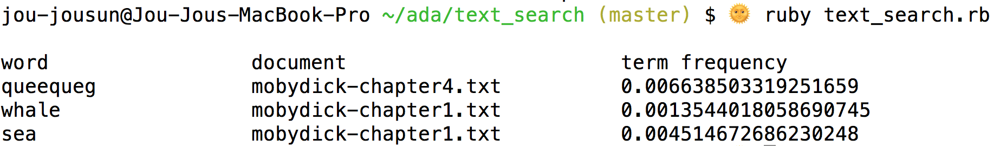

# Text Search

## What is this?


A Ruby command line program that takes in a set of documents and a set of words, and returns the document with the highest [term frequency (TF)](https://en.wikipedia.org/wiki/Tf%E2%80%93idf) for each word as well as the TF.

TF(wi, dj) = the number of times word wi occurs in the document dj/the count of words in document dj

For the purposes of this assignment, a sample set of documents and a sample set of words are used to run this program; see output below:




## Setup and running the program

- Make sure the latest version of Ruby is installed.
- Documents to be searched should be located locally.
- Clone this repo.
- Run ‘bundle install’ which will install `minitest` gem.
- Run the program in your console by typing ```ruby text_search.rb```

##Discussion and things I’d do differently next time

- Inspired by [Hadoop MapReduce](https://en.wikipedia.org/wiki/MapReduce).
- In considering what counts as a word:
	- Must contain a-z (all text is converted to lowercase for consistency)
	- No numbers for now, even though a number can be represented by letters (ie, 2nd)
	- Hyphenated words will be counted as one word, not two ('deep-fried,'left-handed')
	- No whitespace
	- No punctuation
	- No symbols
- For future improvements, could consider broadening what constitutes a word, or expand to other languages.
- To make this scalable, I wouldn’t use the `read` method, as reading the entire file directly into memory can slow down the computer considerably. Instead, using the `foreach` or `each` methods, which read lines and process them one by one rather than ‘slurping’ the whole thing at once.
- For production, this would need more extensive testing. I’ve chosen to create very minimal testing for the meatiest class, where most of the logic lives, but ideally I’d test all the files. For example, adding in error handling and edge cases.

- In addition, I would like to use either the OptionParser class or `STDIN` for more flexible user inputs from the command line. For a sample corpus such as for this assignment, using either of those two options is fine, but for a very large corpus, I think I would want to make sure that the data coming in is as tidy as possible, so perhaps I’d make sure that all the files were contained locally, or for very big data, they should be stored in some way that is easily interfaced by this program.
